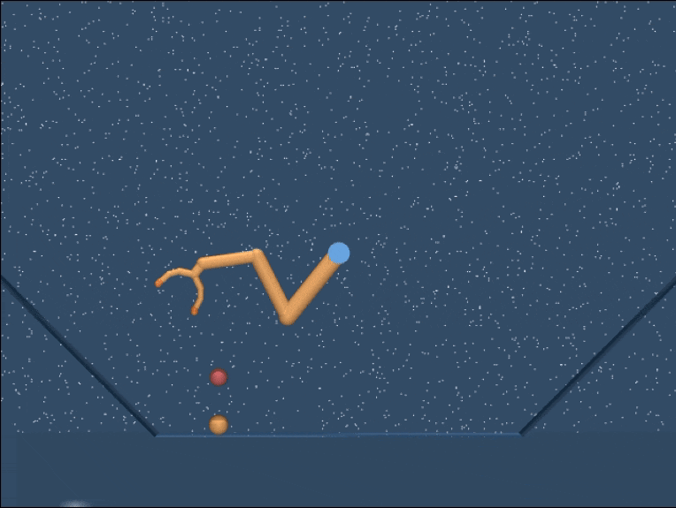
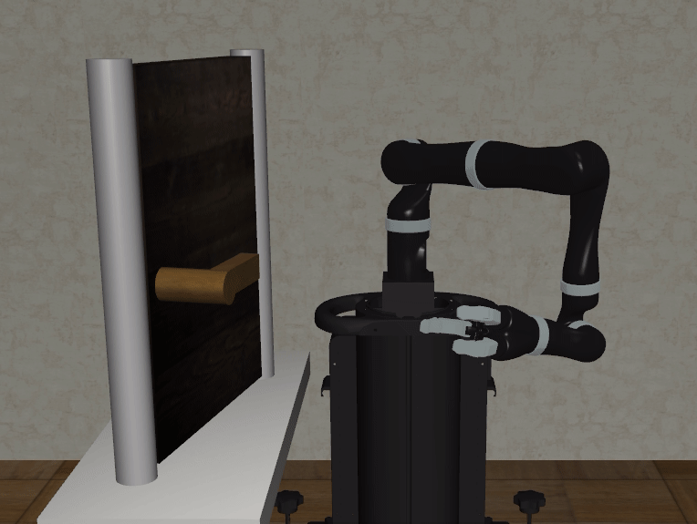

# seqopt

An approach to Hierarchical and Explainable Reinforcement Learning using Reward Decomposition and Options-based Learning for sequentially composable subtasks.

 

**More documentation to come soon...**
